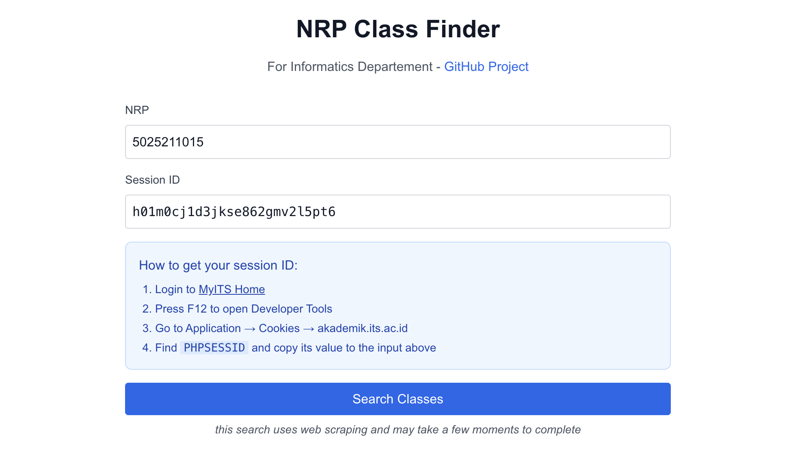
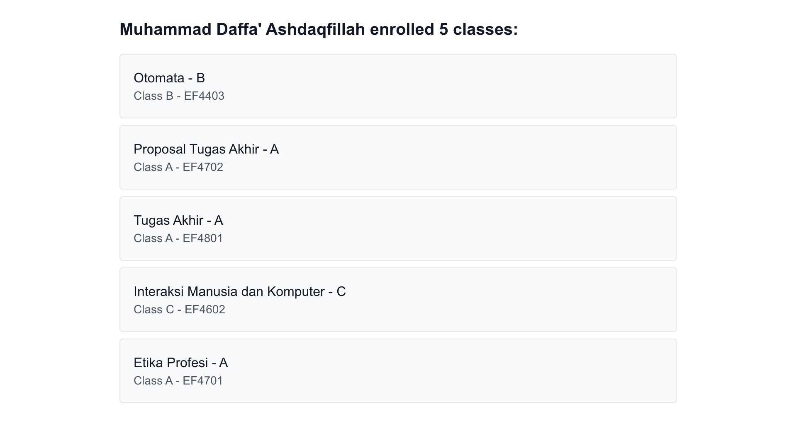

# NRP Class Finder 

Web untuk mencari kelas mahasiswa ITS Informatika berdasarkan NRP. Aplikasi ini membantu menemukan semua kelas yang diambil oleh seorang mahasiswa berdasarkan NRP di semester ini.

> ⚠️ **Notes**: 
> web ini hanya bisa dijalankan secara lokal, karena MyITS Academic membatasi akses berdasarkan IP address, sehingga session ID tidak akan berfungsi jika diakses dari server Vercel. Kalau ada yang tau cara bypass ini, silakan buat pull request.

## Preview

### Search Page

### Result Page

## Fitur

- Pencarian kelas berdasarkan NRP (menggunakan web scraping, butuh waktu beberapa saat)

## Cara Menjalankan di Komputer Lokal

1. **Persiapan Awal**
    - Download repositori: `git clone https://github.com/daf2a/nrp-class-finder.git`
    - Masuk ke folder project: `cd nrp-class-finder`
    - Install semua yang dibutuhkan: `npm install` (jika ada error, gunakan `npm install --legacy-peer-deps`)

2. **Menjalankan Aplikasi**
    - Ketik `npm run dev` di terminal
    - Buka `http://localhost:3000` di browser

3. **Cara Mendapatkan Session ID**
    - Login dulu ke [MyITS Academic](https://akademik.its.ac.id/home.php)
    - Tekan `F12` di keyboard untuk buka Developer Tools
    - Di Chrome: buka tab `Application` → `Cookies` → `akademik.its.ac.id`
    - Di Firefox: buka tab `Storage` → `Cookies` → `akademik.its.ac.id`
    - Cari `PHPSESSID` dan salin nilainya

4. **Cara Menggunakan**
   - Masukkan NRP yang ingin dicari
   - Tempelkan Session ID yang sudah disalin
   - Klik tombol "Search Classes" dan tunggu hasilnya

## Catatan Penting

- Session ID hanya dipakai untuk mengakses MyITS Academic
- Session akan kadaluarsa setelah beberapa waktu
- Jika session kadaluarsa, Anda perlu login ulang dan ambil session ID baru
- Hanya menampilkan kelas di semester yang sedang berjalan

## Kontribusi

Silakan buat issue atau pull request jika menemukan masalah atau punya saran pengembangan.

## Lisensi

MIT License - bebas digunakan dan dimodifikasi sesuai kebutuhan.